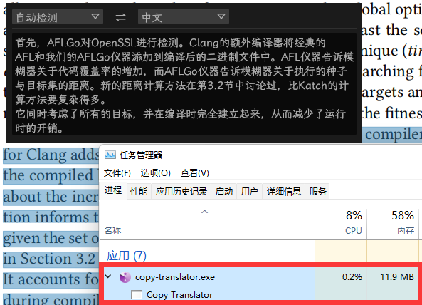

# Copy Translator

Copy Translator 是使用Rust编写的翻译小工具

开发初衷是辅助论文阅读，因为不喜欢内存黑洞Electron，便自己开发一个轻量且简单的来替代

## 使用说明

工具仅一个exe，启动后会驻留后台，选中文本后按 `ctrl+d` 或 `ctrl+q` 唤起翻译界面，`esc`关闭界面，`ctrl+shift+d`完全退出

在界面开启的情况下，可以通过选中文本触发翻译行为，无需快捷键，俗称“划词翻译”

## 版本说明

在v0.1.2版本之前仅提供在线api版本，但是随着用户量增多触发了DeepL的速率墙

在v0.1.2版本我同时提供在线和本地两个版本以缓解这个问题，同时增加更多在线api，通过程序随机选择以增加存活率

后来通过腾讯云的系统监控，我发现有心怀不轨之人通过国外服务器对我搭建的众多在线api进行破坏，导致使用在线api版本的用户无法继续使用

我的程序完全免费，我想可能触及了某些人的利益或者他们单纯使坏，无论如何，我决定不在继续发布在线api版本程序，请大家使用local版本

同时，我会继续优化在线api的质量，增加代理池和鉴权机制，此版本仅提供给我的同学使用

## 感谢列表

- [CopyTranslator](https://copytranslator.github.io/): Electron版本CopyTranslator
- [DeepL](https://deepl.com/): DeepL翻译
- [LXGW WenKai](https://github.com/lxgw/LxgwWenKai): 霞鹜文楷字体
- [egui](https://github.com/emilk/egui): 本工具使用的Gui库
